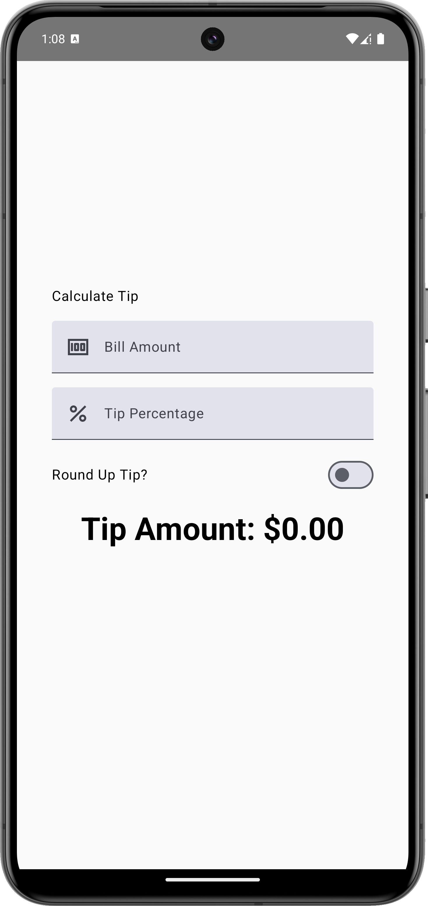

# Calculate Tip App

This is a simple app that calculates the tip based on the total amount and the tip percentage.

Link to the tutorial: [Intro to state in Compose](https://developer.android.com/codelabs/basic-android-kotlin-compose-using-state?continue=https%3A%2F%2Fdeveloper.android.com%2Fcourses%2Fpathways%2Fandroid-basics-compose-unit-2-pathway-3#2)